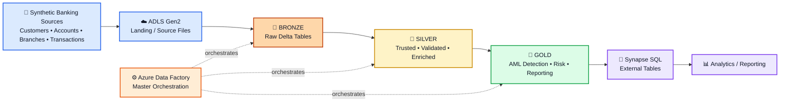
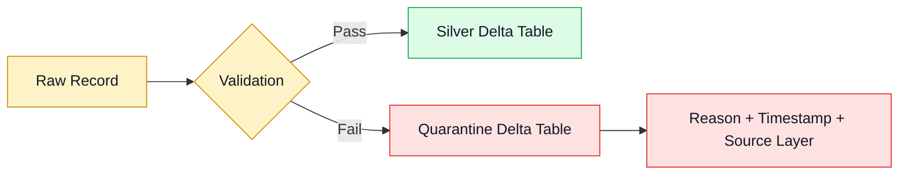
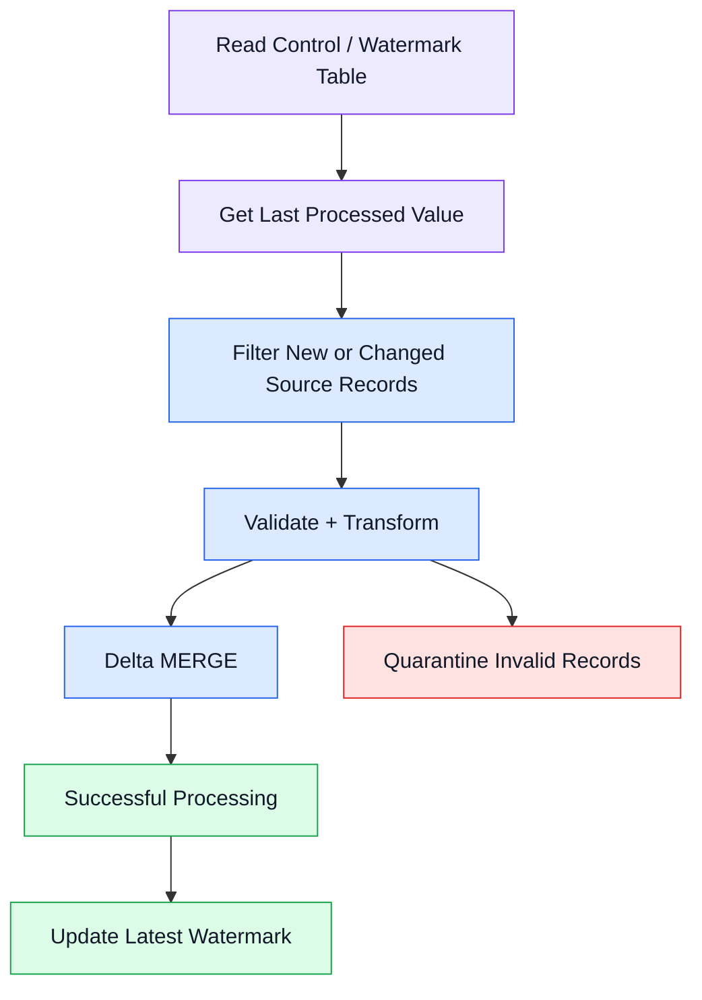
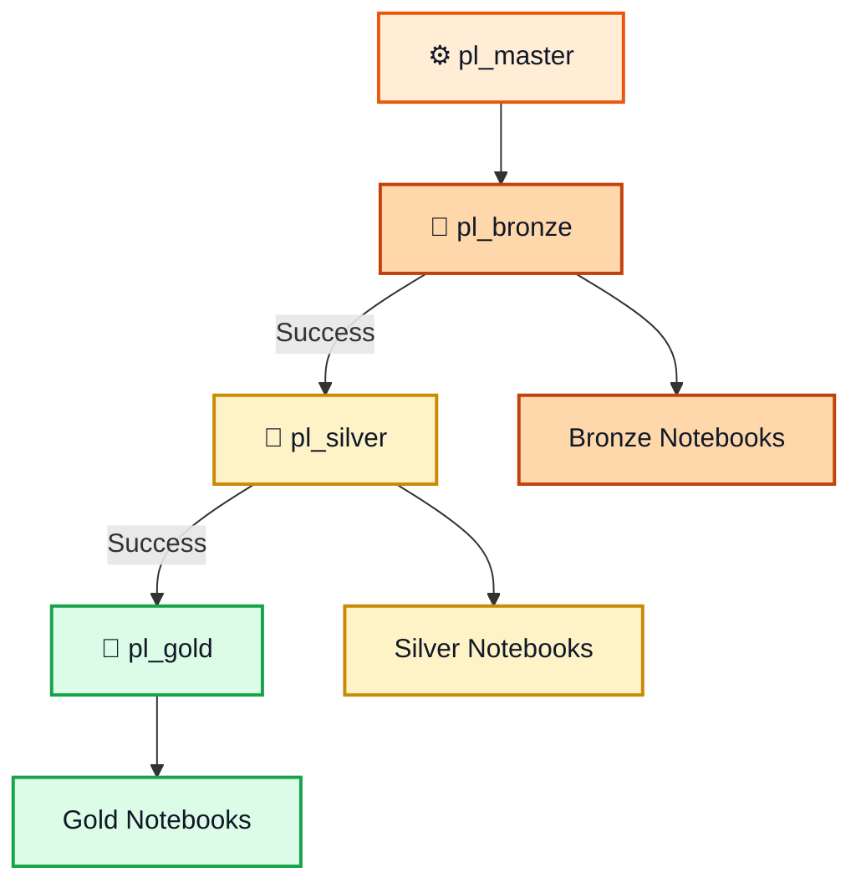

# Bank AML Data Engineering Platform — Architecture

## 1. Architecture Overview

The platform follows a **cloud lakehouse + medallion architecture** in which raw banking data moves through controlled ingestion, quality processing, business transformation, AML detection, and SQL serving.



---

## 2. End-to-End Data Flow

```text
┌──────────────────────────────┐
│ Synthetic Banking Data       │
│ Customers / Accounts /       │
│ Branches / Transactions      │
└──────────────┬───────────────┘
               │
               ▼
┌──────────────────────────────┐
│ ADLS Gen2 Landing            │
│ Source files                 │
└──────────────┬───────────────┘
               │
               ▼
┌──────────────────────────────┐
│ 🥉 BRONZE                    │
│ Raw → Delta                  │
│ Minimal transformation       │
└──────────────┬───────────────┘
               │
               │ validated / standardized
               ▼
┌──────────────────────────────┐
│ 🥈 SILVER                    │
│ Clean • Validate • Dedupe    │
│ Enrich • Quarantine          │
│ Incremental • Historize      │
└──────────────┬───────────────┘
               │
               │ business rules
               ▼
┌──────────────────────────────┐
│ 🥇 GOLD                      │
│ AML Detection                │
│ Customer Risk                │
│ Daily Account Summary        │
└──────────────┬───────────────┘
               │
               ▼
┌──────────────────────────────┐
│ 🔎 SYNAPSE SQL               │
│ External Tables over Delta   │
└──────────────┬───────────────┘
               │
               ▼
        Analytics / Reporting
```

---

## 3. Layer Responsibilities

### 🏦 Source & Landing

The project uses a Python generator to create reproducible synthetic banking data. The source domain contains customers, accounts, branches, and transactions. The generated transaction data deliberately includes data-quality issues and AML-like patterns so the downstream pipeline has realistic engineering scenarios to process.

ADLS Gen2 acts as the cloud landing/storage foundation for the source files and Delta datasets.

### 🥉 Bronze — Raw Data Layer

**Purpose:** Preserve source data in a Delta-backed format with minimal transformation.

Bronze processing includes:

- Explicit Spark schemas.
- Source-file ingestion.
- Delta table creation/storage.
- Basic ingestion metadata where applicable.

Datasets include:

- `customers`
- `accounts`
- `branches`
- `transactions`

**Design principle:** Bronze should remain close to the source so downstream teams have a reliable raw representation for replay, investigation, and further processing.

### 🥈 Silver — Trusted Data Layer

**Purpose:** Turn raw source data into consistent, validated, analytics-ready datasets.

The Silver layer performs:

- Data-type conversion.
- Required-field validation.
- Deduplication.
- Referential-integrity checks.
- Currency normalization.
- Timestamp normalization.
- FX enrichment and USD conversion.
- Controlled defaults for selected missing attributes.
- Quarantine of invalid records.
- Audit metadata.
- Hash-based change detection.
- SCD Type 2-style history tracking.
- Incremental Delta `MERGE` processing.

#### Quarantine flow



Invalid records are therefore preserved for troubleshooting instead of being silently discarded.

### 🥇 Gold — Business & AML Layer

**Purpose:** Convert trusted Silver data into business-oriented analytical datasets.

The Gold layer produces four major outputs:

1. **Structuring detection** — identifies repeated near-threshold deposits within a defined window.
2. **Rapid in/out detection** — identifies substantial outflows occurring shortly after inflows.
3. **Customer risk summary** — aggregates customer activity and AML flags into a risk-oriented view.
4. **Account daily transaction summary** — provides daily account-level transaction metrics.

The AML rules are intentionally simplified portfolio demonstrations rather than regulatory rules.

---

## 4. AML Processing Flow

### Structuring detection

```text
Transactions
     │
     ▼
Identify deposits
     │
     ▼
Find near-threshold amounts
     │
     ▼
Cluster within 48 hours
     │
     ▼
Require at least 3 qualifying deposits
     │
     ▼
Create AML flag
```

The demonstration configuration uses a `$10,000` threshold, a `48-hour` window, amounts from `85%` to `99%` of the threshold, and a minimum of three qualifying deposits.

### Rapid in/out detection

```text
Account inflow
      │
      ▼
Search same account
      │
      ▼
Outflow within 24 hours?
      │
     Yes
      │
      ▼
Outflow >= 85% of inflow?
      │
     Yes
      │
      ▼
High-severity AML flag
```

---

## 5. Incremental Processing Architecture

The reusable watermark framework avoids unnecessary full-table processing.



The watermark should advance only after successful downstream processing, reducing the risk of skipping unprocessed records.

---

## 6. SCD Type 2-Style Architecture

Selected master data uses effective dating and current-record indicators to preserve historical versions.

```text
Incoming record
      │
      ▼
Compare tracked attributes / hash
      │
 ┌────┴─────┐
 │          │
No change   Change detected
 │          │
 ▼          ▼
No action  Expire current version
                │
                ▼
          Insert new version
                │
                ▼
          Mark new version current
```

Typical historical metadata includes:

- `effective_start_date`
- `effective_end_date`
- `is_current`
- Change-detection hash

This allows both current-state and historical analysis.

---

## 7. Orchestration Architecture

Azure Data Factory controls the processing sequence.



The source-controlled pipeline definitions make the processing dependencies visible outside the Azure workspace.

---

## 8. Synapse SQL Serving Architecture

Selected Gold Delta datasets are exposed through Azure Synapse SQL external tables.

```text
Gold Delta Tables
       │
       │ Delta format
       ▼
┌─────────────────────────┐
│ Synapse SQL External    │
│ Tables                  │
└────────────┬────────────┘
             │
             ▼
       SQL Consumers
```

This approach provides SQL access to the Gold data without requiring every dataset to be copied into a separate physical warehouse table.

Examples include:

- `account_daily_txn_summary`
- `customer_risk_summary`
- AML flag outputs

---

## 9. Technology Responsibilities

| Technology | Architectural responsibility |
|---|---|
| Python | Synthetic source-data generation |
| ADLS Gen2 | Cloud data-lake storage / landing |
| Azure Databricks | Distributed processing |
| PySpark | Data transformations and AML rules |
| Delta Lake | ACID storage, MERGE, incremental processing |
| Azure Data Factory | End-to-end orchestration |
| Azure Synapse Analytics | SQL serving / external tables |
| SQL | Analytical table definitions and serving |
| Git / GitHub | Version control and deployment artifacts |

---

## 10. Repository-to-Architecture Mapping

| Repository path | Architecture role |
|---|---|
| `seed_data/` | Synthetic source generation |
| `notebooks/01_bronze/` | Bronze ingestion |
| `notebooks/02_silver/` | Silver quality, enrichment, incremental and historical processing |
| `notebooks/03_gold/` | AML detection and analytical Gold outputs |
| `notebooks/04_utils/` | Reusable watermark/control utilities |
| `adf/pipeline/` | ADF orchestration |
| `synapse/sqlscript/` | Synapse SQL serving definitions |
| `adf-bankaml-dev/` | ADF deployment artifacts |
| `syn-bankaml-dev/` | Synapse deployment artifacts |

---

## 11. Design Principles

The architecture is intentionally built around several practical Data Engineering principles:

- **Layer separation:** raw, trusted, and business-ready data have distinct responsibilities.
- **Data quality before analytics:** invalid data is identified and quarantined before Gold processing.
- **Incremental by design:** watermark processing reduces unnecessary reprocessing.
- **History preservation:** tracked master-data changes are retained using an SCD Type 2-style pattern.
- **Reusable processing:** common watermark logic is separated into utility notebooks.
- **SQL accessibility:** Gold datasets can be consumed by SQL users through Synapse.
- **Orchestration as code:** ADF pipeline definitions are maintained in source control.
- **Synthetic and reproducible data:** the project can be demonstrated without exposing real banking information.
