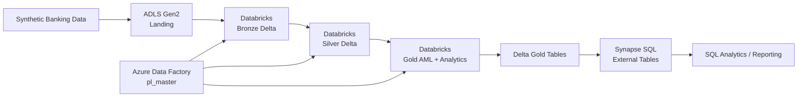

# 🏦 Bank AML Data Engineering Platform

> End-to-end Azure data engineering project for AML analytics, data quality, incremental processing, and transaction-risk detection.

**Azure Data Factory · Azure Databricks · PySpark · Delta Lake · ADLS Gen2 · Azure Synapse Analytics · SQL**

---

## 📌 Project at a glance

Banks process large volumes of customer, account, and transaction data. Before compliance and analytics teams can use that data, it needs to be ingested, cleaned, standardized, enriched, historized, and transformed into business-ready datasets.

This project demonstrates that workflow using a **Bronze → Silver → Gold lakehouse architecture**.

### What this project does

1. Generates reproducible **synthetic banking data** containing realistic data-quality problems and seeded AML patterns.
2. Ingests source files into **Bronze Delta tables** with Azure Databricks.
3. Builds trusted **Silver Delta tables** using validation, deduplication, standardization, referential checks, FX enrichment, quarantine handling, incremental processing, and SCD-style history.
4. Produces **Gold AML outputs** for structuring, rapid in/out activity, customer risk, and daily account transaction analysis.
5. Exposes selected Gold datasets through **Synapse SQL external tables over Delta data**.
6. Uses **Azure Data Factory** to orchestrate Bronze → Silver → Gold execution.

> ⚠️ This is a portfolio/learning project using synthetic data. The AML rules are simplified demonstrations and are **not production compliance rules**.

---

# 🏗️ Architecture



### End-to-end flow

```text
Synthetic source files
        ↓
ADLS Gen2 Landing
        ↓
Azure Databricks — BRONZE
        ↓
Azure Databricks — SILVER
  • validate
  • deduplicate
  • standardize
  • enrich
  • quarantine
  • incremental load
  • historize
        ↓
Azure Databricks — GOLD
  • AML detection
  • customer risk
  • daily account summaries
        ↓
Delta Lake Gold tables
        ↓
Azure Synapse SQL external tables
        ↓
Analytics / Reporting
```

---

# 🧱 Medallion Architecture

## 🥉 Bronze — Raw ingestion

Source entities are loaded into Delta tables with minimal transformation:

- `customers`
- `branches`
- `accounts`
- `transactions`

The source data intentionally contains duplicates, missing values, mixed-case currencies, inconsistent timestamp formats, and invalid relationships so the downstream engineering logic has real problems to solve.

## 🥈 Silver — Trusted data

The Silver notebooks turn raw records into standardized, analytics-ready data.

Key patterns demonstrated:

- Explicit Spark schemas and type conversion
- Duplicate removal
- Mandatory-field validation
- Referential-integrity checks
- Currency normalization
- Timestamp/time-zone normalization
- FX enrichment to calculate `amount_usd`
- Default values for selected missing fields
- Delta `MERGE` operations
- Watermark-based incremental processing
- Hash-based change detection
- SCD Type 2-style effective dating
- Data-quality quarantine with a reason and timestamp
- Audit metadata

## 🥇 Gold — Business and AML analytics

The Gold layer contains business-ready outputs and AML detection results:

| Dataset | Purpose |
|---|---|
| `structuring_flags` | Detect repeated near-threshold deposits |
| `rapid_inout_flags` | Detect rapid inflow followed by substantial outflow |
| `customer_risk_summary` | Aggregate customer activity and AML flags into a risk-oriented view |
| `account_daily_txn_summary` | Daily account-level transaction metrics |

---

# 🚨 AML Detection Logic

## 1. Structuring detection

The project demonstrates a simplified structuring/smurfing rule using deposits clustered by account:

- **48-hour** window
- **$10,000** reporting threshold
- Deposits between **85% and 99%** of the threshold
- At least **3** near-threshold deposits in a cluster

Detected records retain related transaction IDs, the detection window, amounts, severity, and flag status.

## 2. Rapid in/out detection

The project also identifies a large inflow followed by an outflow from the same account:

```text
Same account
    ↓
Inflow
    ↓
Outflow within 24 hours
    ↓
Outflow ≥ 85% of inflow
    ↓
High-severity flag
```

The Gold output retains both transaction IDs, amounts, time gap, customer/account identifiers, and a deterministic flag ID.

## 3. Customer risk summary

Customer-level risk information combines:

- Stated risk rating
- Account count
- Total transaction volume in USD
- Transaction count
- AML flag count
- Behavioral risk score
- Priority review flag

The demonstrated scoring is intentionally simple: **0–1 flags = low, 2 = medium, 3+ = high**.

---

# 🔄 Incremental Processing

A reusable watermark framework is included under `notebooks/04_utils/`.

The control table stores metadata such as:

```text
schema_name
 table_name
 source
 watermark_column
 last_processed_value
 is_active
 updated_timestamp
```

Processing pattern:

```text
Read last watermark
      ↓
Filter rows newer than watermark
      ↓
Validate + transform
      ↓
MERGE / write target
      ↓
Update latest processed value
```

This demonstrates how repeated batch processing can avoid reprocessing the full source dataset.

---

# 🕒 SCD Type 2-style History

Customer and account processing demonstrates historical tracking with:

- `effective_start_date`
- `effective_end_date`
- `is_current`
- Hash-based change detection

Conceptually:

```text
Current version (Y)
        ↓ attribute change
Expire old version (N)
        ↓
Insert new version (Y)
```

---

# 🧪 Synthetic Data Generator

`seed_data/NorthBridge Bank AML generate_seed_data.py` creates reproducible banking source data using Python's standard library.

Approximate generated volume:

- **8,000 customers**
- **30+ branches**
- **10,500+ accounts**
- **170,000+ baseline transactions**, plus injected AML-pattern transactions and duplicates

The generator intentionally introduces:

- Duplicate records
- Missing attributes
- Invalid/missing relationships
- Mixed-case currency codes
- Mixed timestamp formats/time zones
- Missing transaction channels
- Structuring patterns
- Rapid in/out patterns

All identity data is synthetic.

---

# ⚙️ Azure Data Factory Orchestration

The repository contains exported ADF pipeline definitions.

```text
pl_master
   │
   ├──▶ pl_bronze
   │       └── Bronze notebooks
   │
   ├──▶ pl_silver   ← after Bronze succeeds
   │       └── Silver notebooks
   │
   └──▶ pl_gold     ← after Silver succeeds
           └── Gold notebooks
```

Within each layer, notebook dependencies are also defined in source control.

---

# 🗃️ Synapse SQL Serving

The `synapse/sqlscript/` artifacts demonstrate exposing selected Gold Delta datasets through **Azure Synapse SQL external tables**.

This gives SQL users access to the Delta-backed Gold data without requiring those datasets to be copied into separate physical warehouse tables for these external-table use cases.

---

# 🗂️ Repository Structure

```text
bankaml-de-project/
│
├── notebooks/
│   ├── 01_bronze/              # Raw → Bronze Delta ingestion
│   ├── 02_silver/              # Quality, enrichment, incremental + SCD
│   ├── 03_gold/                # AML rules + analytical outputs
│   └── 04_utils/               # Reusable watermark utilities
│
├── adf/                        # ADF source-controlled artifacts
│   ├── factory/
│   ├── linkedService/
│   └── pipeline/
│       ├── pl_master.json
│       ├── pl_bronze.json
│       ├── pl_silver.json
│       └── pl_gold.json
│
├── seed_data/                  # Synthetic banking data generator
│
├── synapse/                    # Synapse workspace + SQL artifacts
│   ├── linkedService/
│   ├── sqlscript/
│   └── integrationRuntime/
│
├── adf-bankaml-dev/            # ADF ARM deployment artifacts
├── syn-bankaml-dev/            # Synapse deployment artifacts
└── README.md
```

---

# 🛠️ Technology Stack

| Technology | Role in the project |
|---|---|
| **Azure Data Factory** | End-to-end orchestration and dependencies |
| **Azure Databricks** | Distributed transformation engine |
| **PySpark** | Data processing and AML rule implementation |
| **Delta Lake** | ACID tables, MERGE, incremental processing |
| **ADLS Gen2** | Data lake storage / landing layer |
| **Azure Synapse Analytics** | SQL serving layer |
| **SQL** | External table definitions and serving |
| **Python** | Synthetic source-data generation |
| **GitHub** | Version control and Azure artifact management |

---

# 💡 Engineering Concepts Demonstrated

- Medallion architecture / lakehouse design
- ETL / ELT
- Batch incremental processing
- Watermark-based processing
- Delta Lake `MERGE`
- SCD Type 2-style historization
- Hash-based change detection
- Data-quality validation
- Quarantine/error handling
- Referential-integrity checks
- Deduplication
- Schema enforcement
- Time-zone normalization
- FX enrichment
- Window functions and aggregations
- PySpark business-rule implementation
- AML pattern detection
- ADF pipeline orchestration
- Synapse external-table serving
- Source-controlled Azure deployment artifacts

---

# 🚀 Recommended Reading Order

If you are new to the repository, follow this path:

### 1. Understand the source data

`seed_data/NorthBridge Bank AML generate_seed_data.py`

### 2. Understand ingestion

`notebooks/01_bronze/`

### 3. Understand reusable incremental logic

`notebooks/04_utils/watermark_incremental_load.ipynb`

### 4. Understand data quality and historization

`notebooks/02_silver/`

### 5. Understand AML detection

`notebooks/03_gold/`

Recommended order:

```text
1. gold_structuring_detection.ipynb
2. gold_rapid_inout_detection.ipynb
3. gold_customer_risk_summary.ipynb
4. gold_account_daily_txn_summary.ipynb
```

### 6. Understand orchestration

`adf/pipeline/pl_master.json` → `pl_bronze.json` → `pl_silver.json` → `pl_gold.json`

### 7. Understand SQL serving

`synapse/sqlscript/`

---

# 🔐 Data & Security

This repository is intended to use synthetic banking data only. No real customer information is required.

For a production implementation, secrets and connection details should be handled through managed identities, Azure Key Vault, or another approved secret-management mechanism rather than committed to source control.

---

# 👤 Author

**Jeevananda Reddy Busi**  
Azure Data Engineer | Azure Data Factory | Databricks | PySpark | Synapse | SQL | Delta Lake

---

## ⭐ Why this project matters

This repository is not just a collection of PySpark notebooks. It demonstrates how the major components of an Azure data platform work together:

```text
Source generation
      ↓
Cloud ingestion
      ↓
Data quality + standardization
      ↓
Incremental + historical processing
      ↓
Business transformations
      ↓
AML detection
      ↓
Risk-oriented Gold datasets
      ↓
SQL-accessible analytics
```

The implementation is designed to be read from end to end and to show practical Data Engineering patterns used when building a maintainable Azure lakehouse pipeline.